# REST CRUD Serverless en AWS (Node.js + React)

Backend con **Serverless Framework** (API Gateway + Lambda + DynamoDB) y frontend **React** (hosting en **Amplify**), con **CI/CD** en CodePipeline + CodeBuild para *multi-stage* (**dev/prod**) y despliegue automático por push a `main`.

---

## ✅ Entregables / Requisitos

- [x] Código **Node.js** (backend) y **React** (frontend)  
- [x] Infra automatizada con **Serverless Framework (IaC)**  
- [x] API REST de **API Gateway** persiste en **DynamoDB**  
- [x] **4–5 Lambdas**: create, get, list, update, delete (sin proxy directo de APIGW a DynamoDB)  
- [x] **CI/CD** multi-stage (dev/prod) con CodePipeline/CodeBuild (+ frontend Amplify Hosting)  
- [x] Template funcional y **documentado**  
- [x] Repositorio público con commits frecuentes  
- [x] **Capturas** de Source/Build/Artifacts/Variables (abajo)

---

## 🧱 Arquitectura

```mermaid
flowchart LR
  A[GitHub (main)] --> P[CodePipeline]

  subgraph Backend (AWS)
    direction TB
    G[API Gateway REST]
    L1[Lambda createItem]
    L2[Lambda getItem]
    L3[Lambda listItems]
    L4[Lambda updateItem]
    L5[Lambda deleteItem]
    D[(DynamoDB: ItemsTable-${stage})]

    G <--> L1
    G <--> L2
    G <--> L3
    G <--> L4
    G <--> L5

    L1 --> D
    L2 --> D
    L3 --> D
    L4 --> D
    L5 --> D
  end

  B1[Serverless deploy --stage dev] --> G
  B2[Serverless deploy --stage prod] --> G

  R[React App (Amplify)] <--> G
```

---

## 🖼️ Capturas (CodePipeline / CodeBuild / API / DynamoDB / Amplify)

> Las imágenes viven en `docs/`.

### Pipeline

- Resumen pipeline  
  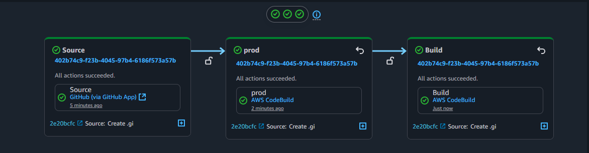

- Última ejecución  
  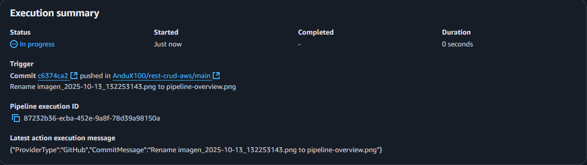

### CodeBuild – DEV

- Source  
  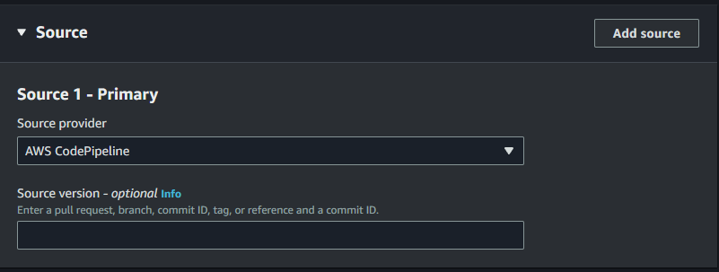

- Buildspec  
  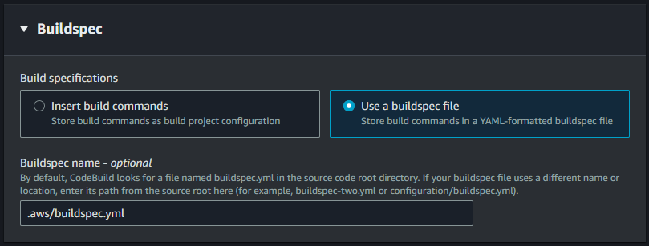

- Environment  
  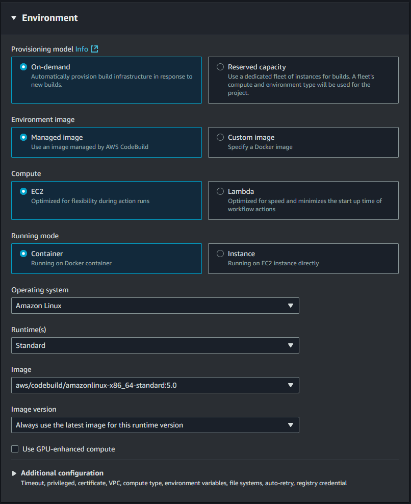

- Artifacts & Logs  
  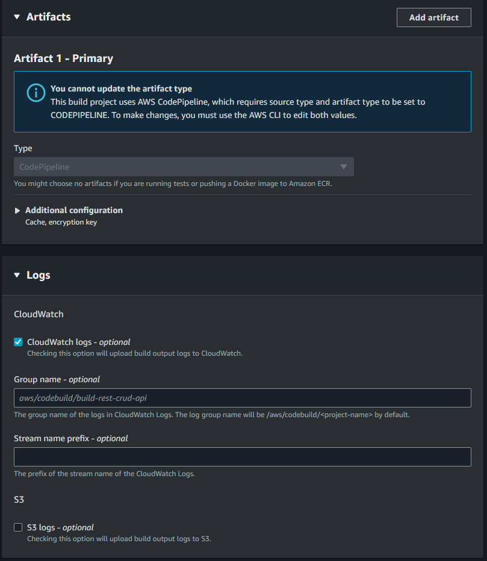

### CodeBuild – PROD

- Source  
  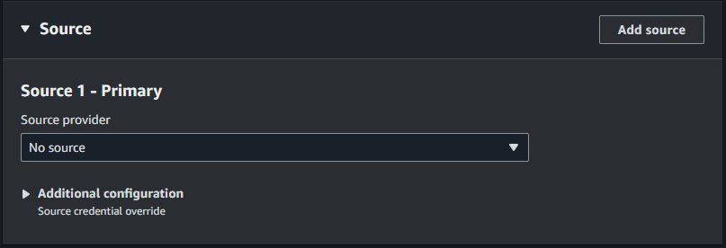

- Buildspec  
  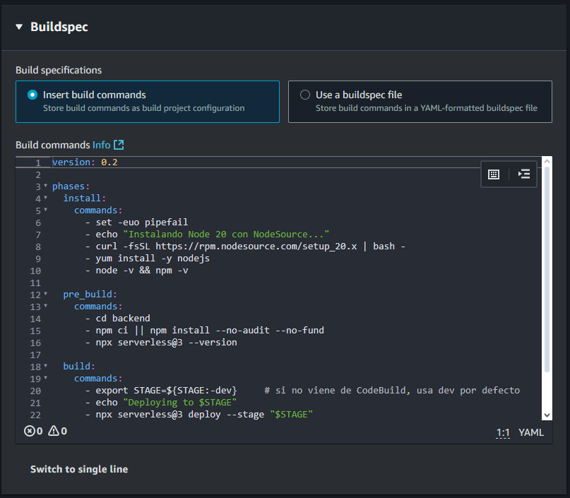

- Environment  
  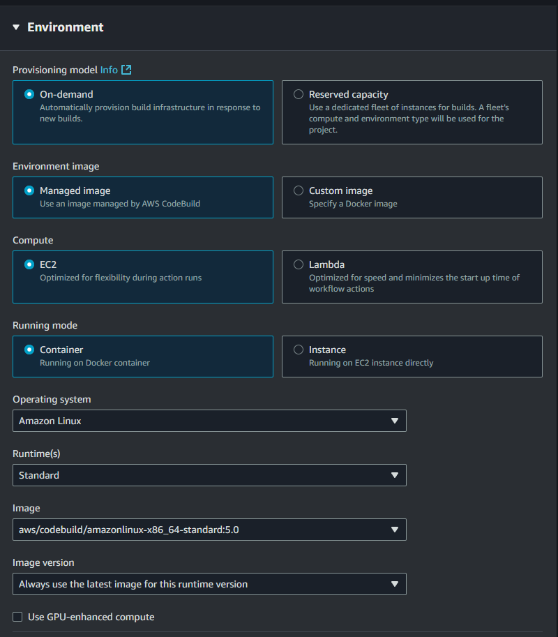

- Artifacts & Logs  
  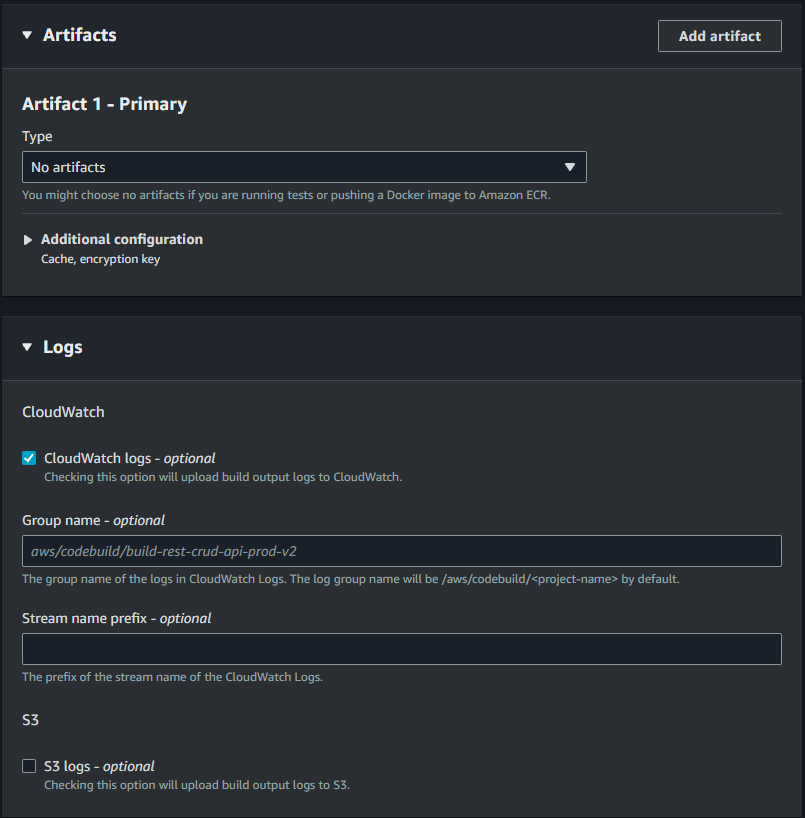

### API Gateway y DynamoDB

- API Gateway (recursos)  
  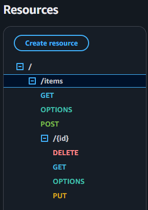

- DynamoDB (tabla DEV)  
  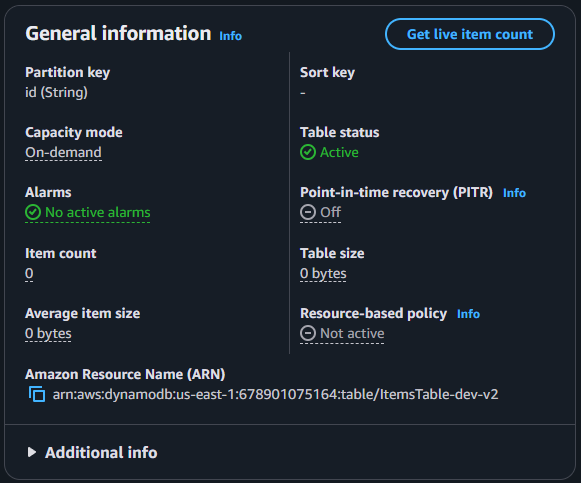

- DynamoDB (tabla PROD)  
  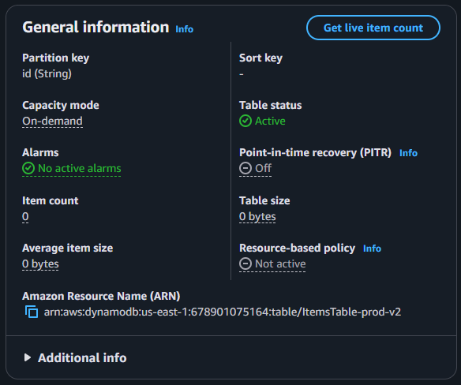

### Amplify (hosting React)

- App (overview)  
  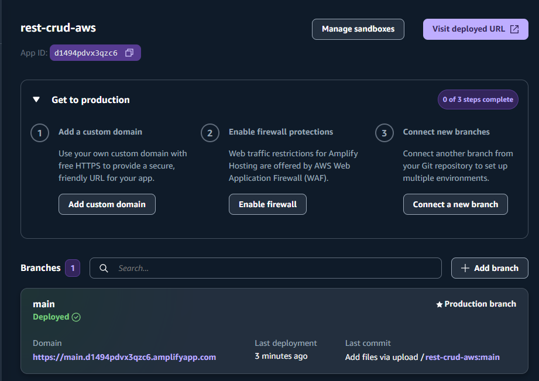

- UI App  
  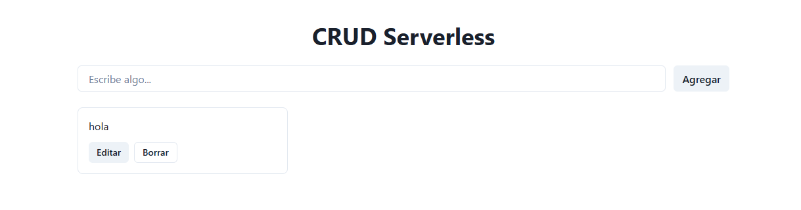

---

## 📦 Backend (Serverless Framework)

### `backend/serverless.yml` (extracto)

```yml
service: rest-crud-api
frameworkVersion: '3'

provider:
  name: aws
  runtime: nodejs20.x
  region: us-east-1
  stage: ${opt:stage, 'dev'}
  environment:
    TABLE_NAME: ItemsTable-${self:provider.stage}
  iam:
    role:
      statements:
        - Effect: Allow
          Action:
            - dynamodb:PutItem
            - dynamodb:GetItem
            - dynamodb:Scan
            - dynamodb:UpdateItem
            - dynamodb:DeleteItem
          Resource:
            - arn:aws:dynamodb:${self:provider.region}:*:table/${self:provider.environment.TABLE_NAME}
  deploymentBucket:
    name: serverless-artifacts-678901075164-us-east-1
    blockPublicAccess: true

functions:
  createItem:
    handler: src/handler.createItem
    events:
      - http:
          path: items
          method: post
          cors: true

  getItem:
    handler: src/handler.getItem
    events:
      - http:
          path: items/{id}
          method: get
          cors: true

  listItems:
    handler: src/handler.listItems
    events:
      - http:
          path: items
          method: get
          cors: true

  updateItem:
    handler: src/handler.updateItem
    events:
      - http:
          path: items/{id}
          method: put
          cors: true

  deleteItem:
    handler: src/handler.deleteItem
    events:
      - http:
          path: items/{id}
          method: delete
          cors: true

resources:
  Resources:
    ItemsTable:
      Type: AWS::DynamoDB::Table
      Properties:
        TableName: ${self:provider.environment.TABLE_NAME}
        BillingMode: PAY_PER_REQUEST
        AttributeDefinitions:
          - AttributeName: id
            AttributeType: S
        KeySchema:
          - AttributeName: id
            KeyType: HASH
```

---

## 🏗️ CI/CD Backend – CodeBuild (`.aws/buildspec.yml`)

```yaml
version: 0.2

env:
  variables:
    STAGE: ${STAGE:-dev}

phases:
  install:
    commands:
      - node -v
      - npm -v

  pre_build:
    commands:
      - cd backend
      - if [ -f package-lock.json ]; then npm ci; else npm install --no-audit --no-fund; fi
      - npx serverless@3 --version

  build:
    commands:
      - echo "Deploying to ${STAGE}"
      - npx serverless@3 deploy --stage "${STAGE}"

  post_build:
    commands:
      - echo "Build completed on $(date)"
```

> `STAGE` lo inyecta CodeBuild/CodePipeline para desplegar `dev` o `prod`.

---

## 🎨 Frontend (React + Vite + Chakra UI, hosting en Amplify)

### Variable de entorno (build-time)

- `VITE_API_URL` → `https://<api_id>.execute-api.us-east-1.amazonaws.com/prod`

Se inyecta en Amplify a través de `amplify.yml` (monorepo con `appRoot: frontend`).

### `amplify.yml`

```yaml
version: 1
applications:
  - appRoot: frontend
    env:
      variables:
        VITE_API_URL: https://<api_id>.execute-api.us-east-1.amazonaws.com/prod
    frontend:
      phases:
        preBuild:
          commands:
            - npm ci || npm install
            - echo "VITE_API_URL=$VITE_API_URL"
        build:
          commands:
            - npm run build
      artifacts:
        baseDirectory: dist
        files:
          - '**/*'
      cache:
        paths:
          - node_modules/**/*
```

> Sustituye `<api_id>` por el ID real de tu API Gateway.

### `frontend/src/App.jsx` (extracto)

```jsx
import React, { useEffect, useState } from 'react'
import axios from 'axios'
import { Box, Container, Heading, Stack, Input, Button, SimpleGrid, Text, useToast } from '@chakra-ui/react'

const API_BASE = import.meta.env.VITE_API_URL
console.log('[APP] VITE_API_URL =', API_BASE)

export default function App() {
  const [items, setItems] = useState([])
  const [text, setText] = useState('')
  const toast = useToast()

  const load = async () => {
    const { data } = await axios.get(`${API_BASE}/items`)
    setItems(data)
  }

  useEffect(() => { load() }, [])

  const createItem = async () => {
    if (!text.trim()) return
    const { data } = await axios.post(`${API_BASE}/items`, { text })
    setText('')
    toast({ title: 'Creado', status: 'success', duration: 1500 })
    setItems(prev => [data, ...prev])
  }

  const updateItem = async (id) => {
    const val = prompt('Nuevo texto:')
    if (!val) return
    const { data } = await axios.put(`${API_BASE}/items/${id}`, { text: val })
    setItems(prev => prev.map(i => i.id === id ? data : i))
  }

  const deleteItem = async (id) => {
    await axios.delete(`${API_BASE}/items/${id}`)
    setItems(prev => prev.filter(i => i.id !== id))
  }

  return (
    <Container maxW="container.lg" py={10}>
      <Heading mb={6} textAlign="center">CRUD Serverless</Heading>

      <Stack direction={{ base: 'column', md: 'row' }} gap={3} mb={6}>
        <Input placeholder="Escribe algo..." value={text} onChange={e => setText(e.target.value)} />
        <Button onClick={createItem}>Agregar</Button>
      </Stack>

      <SimpleGrid columns={{ base: 1, sm: 2, lg: 3, xl: 4 }} spacing={4}>
        {items.map(it => (
          <Box key={it.id} p={4} borderWidth="1px" borderRadius="lg">
            <Text noOfLines={3}>{it.text}</Text>
            <Stack direction="row" mt={3}>
              <Button size="sm" onClick={() => updateItem(it.id)}>Editar</Button>
              <Button size="sm" onClick={() => deleteItem(it.id)} variant="outline">Borrar</Button>
            </Stack>
          </Box>
        ))}
      </SimpleGrid>
    </Container>
  )
}
Este código es un componente de React funcional llamado App que actúa como la interfaz de usuario (frontend) para interactuar con tu API REST CRUD desplegada en AWS. Está construido utilizando hooks de React (useState, useEffect) y la librería de componentes Chakra UI para el diseño, y Axios para hacer las peticiones HTTP.En esencia, es una aplicación de lista de tareas o "items" que realiza las cuatro operaciones CRUD (Crear, Leer, Actualizar, Borrar) contra el backend Serverless que ya revisamos.1. Importaciones y Configuración InicialEsta sección trae las herramientas y establece el punto de conexión con el backend.Librerías:React Hooks (useEffect, useState): Para manejar el estado y los efectos secundarios (como cargar datos al inicio).Axios: Un cliente HTTP muy popular para hacer peticiones (GET, POST, PUT, DELETE) a la API.Chakra UI: Un framework de componentes para React que facilita la creación de la interfaz de usuario con estilos modernos (Box, Container, Button, Input, etc.).useToast: Un hook de Chakra UI para mostrar notificaciones emergentes al usuario.API_BASE:JavaScriptconst API_BASE = import.meta.env.VITE_API_URL 
Aquí se obtiene la URL de tu API desplegada (el endpoint de API Gateway) de una variable de entorno (.env o similar). Esto permite que el código de React sepa dónde enviar sus peticiones, haciendo el frontend independiente del entorno de despliegue.2. Gestión del Estado (Hooks)El estado del componente controla la información que se muestra y las entradas del usuario.const [items, setItems] = useState([]): Almacena la lista de objetos o items recuperados de la API. Inicialmente, es un array vacío.const [text, setText] = useState(''): Almacena el texto que el usuario introduce en el campo de entrada para crear un nuevo item.const toast = useToast(): Inicializa la función para mostrar notificaciones.3. Lógica de Interacción con la API (Funciones CRUD)Estas son las funciones asíncronas que envían peticiones HTTP a tu backend Serverless.FunciónVerbo HTTPPropósitoURL Utilizadaload()GETLeer (Read): Recupera todos los items del backend y actualiza el estado items.${API_BASE}/itemscreateItem()POSTCrear (Create): Envía el texto del campo de entrada ({ text }) para crear un nuevo item. Limpia el campo de entrada, muestra un toast de éxito, y actualiza la lista items añadiendo el nuevo al principio.${API_BASE}/itemsupdateItem(id)PUTActualizar (Update): Pide un nuevo valor usando prompt(). Si el usuario lo introduce, envía la petición con el nuevo texto, y actualiza el item correspondiente en el estado items mapeando la lista.${API_BASE}/items/${id}deleteItem(id)DELETEBorrar (Delete): Envía la petición de eliminación para el ID dado. Una vez completado, actualiza el estado items filtrando y eliminando el item de la lista.${API_BASE}/items/${id}Efecto Secundario (useEffect)JavaScriptuseEffect(() => { load() }, [])
Este hook asegura que la función load() se ejecute solo una vez cuando el componente se monta por primera vez ([] como segundo argumento), cargando así los datos iniciales de la lista al abrir la aplicación.4. Renderizado (JSX y UI)Esta es la estructura visual del componente, usando los componentes de Chakra UI:Contenedor (Container): Define el ancho máximo y el espaciado de la aplicación.Encabezado (Heading): Muestra el título "CRUD Serverless".Formulario de Creación (Stack y Input):Un campo Input donde el valor está enlazado al estado text (value={text}).El evento onChange actualiza el estado text cada vez que el usuario escribe.Un Button "Agregar" que, al hacer clic, ejecuta la función createItem.Lista de Items (SimpleGrid y map):El SimpleGrid organiza la visualización de los items en un diseño de rejilla que se adapta a diferentes tamaños de pantalla (columns={{ base: 1, sm: 2, ... }}).Se utiliza el método map() para iterar sobre el array items y renderizar un Box (una tarjeta) por cada item.Cada tarjeta muestra el texto del item (Text noOfLines={3}) y dos botones de acción:"Editar": Llama a updateItem(it.id)."Borrar": Llama a deleteItem(it.id)```


---

## 🧪 Pruebas rápidas con `curl`

```bash
API="https://<api_id>.execute-api.us-east-1.amazonaws.com/prod"

# Crear
curl -i -X POST "$API/items"   -H 'Content-Type: application/json'   -d '{"text":"hola desde curl"}'

# Listar
curl -s "$API/items" | jq

# Obtener por id
curl -s "$API/items/<id>" | jq

# Actualizar
curl -i -X PUT "$API/items/<id>"   -H 'Content-Type: application/json'   -d '{"text":"actualizado"}'

# Eliminar
curl -i -X DELETE "$API/items/<id>"
```

---

## 🧹 Limpieza

```bash
# Backend
cd backend
npx serverless@3 remove --stage dev
npx serverless@3 remove --stage prod

# Frontend
# En AWS Amplify: App → Actions → Delete app
```

---

## 📂 Estructura (resumen)

```
.
├── .aws/
│   └── buildspec.yml
├── backend/
│   ├── src/handler.js ...
│   └── serverless.yml
├── frontend/
│   ├── src/App.jsx
│   ├── index.html
│   ├── package.json
│   └── vite.config.js
├── docs/
│   ├── pipeline-overview.png
│   ├── pipeline-execution-summary.png
│   ├── codebuild-dev-*.png
│   ├── codebuild-prod-*.png
│   ├── apigw-resources.png
│   ├── dynamodb-dev-table.png
│   ├── dynamodb-prod-table.png
│   ├── amplify-overview.png
│   └── app-ui.png
└── amplify.yml
```

---

## 📌 Notas

- **CORS** habilitado en endpoints HTTP de Serverless.  
- **Amplify** usa `amplify.yml` con `applications[0].appRoot=frontend` (monorepo).  
- **VITE_API_URL** debe apuntar a tu **API Gateway** (`/prod`).

